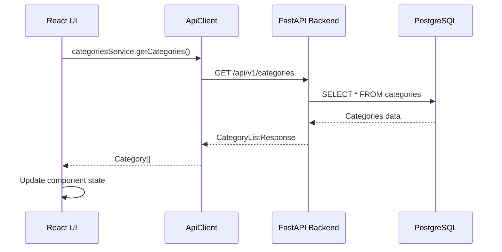
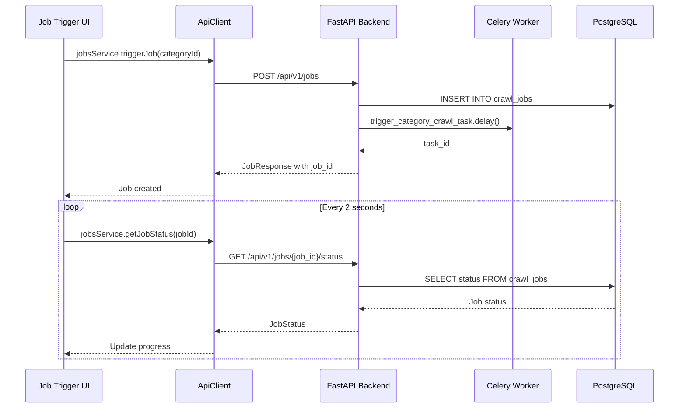

# Backend-Frontend Integration Architecture

## Overview

This document outlines the integration patterns between the FastAPI backend and React frontend in the Google News Scraper system, based on actual implementation analysis and addressing the challenges faced during development.

## Current Integration Status

### ✅ **SUCCESSFULLY IMPLEMENTED**

#### 1. **Categories Management Integration**
- **Backend**: Complete CRUD API at `/api/v1/categories`
- **Frontend**: Full UI implementation with components:
  - `CategoriesList.tsx` - Display categories with CRUD actions
  - `CategoryForm.tsx` - Create/edit category forms with validation
  - `DeleteConfirmationDialog.tsx` - Safe delete confirmation
- **Integration**: TypeScript service layer in `categoriesService.ts`

#### 2. **API Client Architecture**
```typescript
// Location: frontend/src/services/api.ts
class ApiClient {
  private baseURL: string = 'http://localhost:8000'

  // Comprehensive error handling with ApiError class
  // Automatic JSON parsing and correlation ID tracking
  // Support for all HTTP methods (GET, POST, PUT, DELETE, PATCH)
}
```

#### 3. **Error Handling Pattern**
```typescript
// Frontend ApiError matches backend error responses
export class ApiError extends Error {
  status: number;
  data?: unknown;
  // Maps directly to FastAPI HTTPException responses
}
```

#### 4. **CORS Configuration**
```python
# Backend: src/api/main.py
if settings.ENVIRONMENT == "development":
    dev_origins = ["http://localhost:3000", "http://localhost:3001"]
    app.add_middleware(CORSMiddleware, allow_origins=dev_origins)
```

#### 5. **Type Safety Integration**
```typescript
// Frontend: src/types/shared.ts
export interface Category {
  id: string;
  name: string;
  keywords: string[];
  exclude_keywords: string[];
  is_active: boolean;
  created_at: string;
  updated_at: string;
}
// Matches backend Pydantic CategoryResponse schema exactly
```

### 🔧 **PARTIALLY IMPLEMENTED**

#### 6. **Job Management Backend Infrastructure**
**Backend Status**: ✅ Complete
- Celery tasks: `trigger_category_crawl_task`, `crawl_category_task`
- Job tracking: `CrawlJobRepository` with comprehensive status management
- Error handling: Advanced retry logic and correlation ID tracking

**Frontend Status**: ❌ Missing
- Job triggering UI components not implemented
- Job status polling mechanism not built
- Real-time progress updates not integrated

### ❌ **NOT IMPLEMENTED**

#### 7. **Articles Management Integration**
**Backend Gaps**:
- Missing `/api/v1/articles` REST endpoints
- `ArticleRepository` methods not fully implemented
- Article filtering and pagination logic missing

**Frontend Gaps**:
- Articles listing components not created
- Search and filtering UI not implemented
- Article detail view not built

#### 8. **Scheduling Management Integration**
**Backend Gaps**:
- Missing `/api/v1/schedules` REST endpoints
- Dynamic Celery Beat integration not implemented
- Schedule persistence layer missing

**Frontend Gaps**:
- Schedule creation/management UI not implemented
- Interval configuration components missing
- Schedule monitoring interface not built

## Integration Patterns and Conventions

### **API Communication Pattern**

```typescript
// Service Layer Pattern (Example: categoriesService.ts)
export class CategoriesService {
  async getCategories(params?: GetCategoriesParams): Promise<Category[]> {
    const queryParams = new URLSearchParams();
    if (params?.active_only !== undefined) {
      queryParams.append('active_only', params.active_only.toString());
    }

    const response = await apiClient.get<CategoryListResponse>(
      `/api/v1/categories?${queryParams.toString()}`
    );
    return response.categories;
  }
}
```

### **Error Handling Pattern**

```typescript
// Component Error Handling (Example: CategoriesList.tsx)
const [error, setError] = useState<string | null>(null);
const [loading, setLoading] = useState(false);

try {
  setLoading(true);
  setError(null);
  const categories = await categoriesService.getCategories();
  setCategories(categories);
} catch (err) {
  if (err instanceof ApiError) {
    setError(`Error ${err.status}: ${err.message}`);
  } else {
    setError('An unexpected error occurred');
  }
} finally {
  setLoading(false);
}
```

### **State Management Pattern**

```typescript
// React Context for Global State (Example: Categories)
const CategoriesContext = createContext<CategoriesContextValue | undefined>(undefined);

export const CategoriesProvider: React.FC<{ children: React.ReactNode }> = ({ children }) => {
  const [categories, setCategories] = useState<Category[]>([]);
  const [loading, setLoading] = useState(false);

  // CRUD operations that update local state and call API
  const refreshCategories = async () => { /* ... */ };
  const createCategory = async (data: CreateCategoryData) => { /* ... */ };

  return (
    <CategoriesContext.Provider value={{ categories, loading, refreshCategories, createCategory }}>
      {children}
    </CategoriesContext.Provider>
  );
};
```

## Required Integration Implementations

### **1. Job Management Integration (Priority 1)**

#### **Backend Requirements**:
```python
# New file: src/api/routes/jobs.py
@router.get("/api/v1/jobs", response_model=JobListResponse)
async def list_jobs(
    status: Optional[CrawlJobStatus] = Query(None),
    category_id: Optional[UUID] = Query(None),
    limit: int = Query(50, ge=1, le=100),
    offset: int = Query(0, ge=0),
    manager: JobManager = Depends(get_job_manager)
) -> JobListResponse:
    # Implementation needed

@router.post("/api/v1/jobs", response_model=JobResponse)
async def trigger_manual_job(
    request: TriggerJobRequest,
    manager: JobManager = Depends(get_job_manager)
) -> JobResponse:
    # Use existing trigger_category_crawl_task Celery task
```

#### **Frontend Requirements**:
```typescript
// New file: frontend/src/services/jobsService.ts
export class JobsService {
  async triggerJob(categoryId: string, priority?: number): Promise<Job>;
  async getJobs(filters?: JobFilters): Promise<JobListResponse>;
  async getJobStatus(jobId: string): Promise<JobStatus>;
}

// New components needed:
// - JobTriggerForm.tsx
// - JobStatusMonitor.tsx
// - JobsList.tsx
```

#### **Real-time Integration Pattern**:
```typescript
// Job Status Polling Hook
export const useJobStatusPolling = (jobId: string) => {
  const [status, setStatus] = useState<JobStatus | null>(null);

  useEffect(() => {
    const interval = setInterval(async () => {
      try {
        const currentStatus = await jobsService.getJobStatus(jobId);
        setStatus(currentStatus);

        // Stop polling when job completes
        if (currentStatus.status === 'completed' || currentStatus.status === 'failed') {
          clearInterval(interval);
        }
      } catch (error) {
        console.error('Error polling job status:', error);
      }
    }, 2000); // Poll every 2 seconds

    return () => clearInterval(interval);
  }, [jobId]);

  return status;
};
```

### **2. Articles Management Integration (Priority 2)**

#### **Backend Requirements**:
```python
# Update: src/database/repositories/article_repo.py
class ArticleRepository:
    async def get_articles_paginated(
        self,
        category_id: Optional[UUID] = None,
        status: Optional[str] = None,
        date_from: Optional[date] = None,
        date_to: Optional[date] = None,
        search: Optional[str] = None,
        limit: int = 20,
        offset: int = 0,
        sort_by: str = "created_at",
        sort_order: str = "desc"
    ) -> Tuple[List[Article], int]:
        # Implementation needed with filtering and pagination

# New file: src/api/routes/articles.py
@router.get("/api/v1/articles", response_model=ArticleListResponse)
async def list_articles(
    category_id: Optional[UUID] = Query(None),
    search: Optional[str] = Query(None),
    # ... other filter parameters
) -> ArticleListResponse:
    # Implementation needed
```

#### **Frontend Requirements**:
```typescript
// New file: frontend/src/services/articlesService.ts
export class ArticlesService {
  async getArticles(filters?: ArticleFilters): Promise<ArticleListResponse>;
  async getArticle(articleId: string): Promise<ArticleDetail>;
}

// New components needed:
// - ArticlesList.tsx - Paginated table with search/filtering
// - ArticleFilters.tsx - Search and filter controls
// - ArticleDetail.tsx - Modal or page for full article view
// - Pagination.tsx - Reusable pagination component
```

### **3. Scheduling Management Integration (Priority 3)**

#### **Backend Requirements**:
```python
# New model: src/database/models/schedule.py
class CrawlSchedule(Base):
    __tablename__ = "crawl_schedules"

    id: Mapped[UUID] = mapped_column(UUID(as_uuid=True), primary_key=True, default=uuid4)
    name: Mapped[str] = mapped_column(String(255), nullable=False)
    category_id: Mapped[UUID] = mapped_column(ForeignKey("categories.id"), nullable=False)
    interval_minutes: Mapped[int] = mapped_column(Integer, nullable=False)
    is_active: Mapped[bool] = mapped_column(Boolean, default=True, nullable=False)
    # ... other fields

# New file: src/api/routes/schedules.py
# Integration with Celery Beat for dynamic scheduling
```

#### **Frontend Requirements**:
```typescript
// New components needed:
// - ScheduleForm.tsx - Create/edit schedule with interval selection
// - SchedulesList.tsx - Manage existing schedules
// - ScheduleMonitor.tsx - Show next run times and status
```

## Data Flow Diagrams

### **Current Working Flow (Categories)**



### **Required Flow (Job Management)**



## Configuration and Environment

### **Development Environment**
```bash
# Backend runs on: http://localhost:8000
# Frontend runs on: http://localhost:3000
# API base URL: VITE_API_BASE_URL=http://localhost:8000
```

### **Docker Integration**
```yaml
# docker-compose.yml
services:
  backend:
    ports:
      - "8000:8000"

  frontend:
    ports:
      - "3000:3000"
    environment:
      - VITE_API_BASE_URL=http://backend:8000
    depends_on:
      - backend
```

### **CORS Configuration**
```python
# Backend development CORS settings
DEV_CORS_ORIGINS = ["http://localhost:3000", "http://localhost:3001"]

# Production CORS (environment-specific)
PROD_CORS_ORIGINS = ["https://your-production-domain.com"]
```

## Testing Integration Patterns

### **Frontend API Integration Tests**
```typescript
// Example: categoriesService.test.ts
describe('CategoriesService', () => {
  beforeEach(() => {
    // Mock API client responses
    jest.spyOn(apiClient, 'get').mockResolvedValue(mockCategoryResponse);
  });

  it('should fetch categories with correct parameters', async () => {
    await categoriesService.getCategories({ active_only: true });

    expect(apiClient.get).toHaveBeenCalledWith(
      '/api/v1/categories?active_only=true'
    );
  });
});
```

### **Backend-Frontend Contract Testing**
```python
# Example: test API contract matches frontend expectations
def test_category_response_matches_frontend_interface():
    category = create_test_category()
    response = client.get(f"/api/v1/categories/{category.id}")

    assert response.status_code == 200
    data = response.json()

    # Ensure all required fields exist with correct types
    assert "id" in data and isinstance(data["id"], str)
    assert "name" in data and isinstance(data["name"], str)
    assert "keywords" in data and isinstance(data["keywords"], list)
    # ... validate all fields match TypeScript interface
```

## Performance and Optimization

### **API Response Optimization**
- **Pagination**: Implement consistent pagination across all list endpoints
- **Field Selection**: Allow clients to specify which fields to include/exclude
- **Caching**: Add appropriate cache headers for static data
- **Compression**: Enable gzip compression for API responses

### **Frontend Optimization**
- **Lazy Loading**: Load components and data on-demand
- **Request Debouncing**: Debounce search input to reduce API calls
- **Optimistic Updates**: Update UI immediately, rollback on API errors
- **Connection Pooling**: Reuse HTTP connections in ApiClient

## Security Considerations

### **Current State (No Authentication)**
- All API endpoints currently open
- CORS configured for development origins only
- No rate limiting implemented

### **Future Authentication Integration**
```typescript
// Frontend: Add authentication headers
class ApiClient {
  private getAuthHeaders(): Record<string, string> {
    const token = localStorage.getItem('auth_token');
    return token ? { Authorization: `Bearer ${token}` } : {};
  }
}
```

```python
# Backend: Add authentication middleware
from fastapi.security import HTTPBearer
security = HTTPBearer()

@router.post("/api/v1/jobs")
async def trigger_job(token: str = Depends(security)):
    # Validate token and get user context
```

## Troubleshooting Common Integration Issues

### **1. CORS Errors**
**Symptom**: Browser console shows CORS policy errors
**Solution**:
- Verify backend CORS origins include frontend URL
- Check that preflight OPTIONS requests are handled
- Ensure credentials are configured consistently

### **2. Type Mismatches**
**Symptom**: TypeScript errors or runtime type issues
**Solution**:
- Ensure frontend interfaces match backend Pydantic schemas exactly
- Use JSON schema validation on both ends
- Implement contract testing

### **3. Network Timeouts**
**Symptom**: Requests failing with timeout errors
**Solution**:
- Implement request timeout configuration in ApiClient
- Add retry logic for transient failures
- Use connection pooling to reduce latency

### **4. Error Handling Inconsistencies**
**Symptom**: Frontend can't properly handle backend errors
**Solution**:
- Standardize error response format across all endpoints
- Map HTTP status codes to appropriate user messages
- Include correlation IDs for debugging

## Migration Strategy for Remaining Features

### **Phase 1: Job Management UI (Sprint 1)**
1. Implement missing job API endpoints
2. Create job triggering components
3. Add job status polling mechanism
4. Integrate with existing Celery infrastructure

### **Phase 2: Articles Interface (Sprint 2)**
1. Complete ArticleRepository implementation
2. Build articles API endpoints with filtering
3. Create articles listing and search UI
4. Implement pagination component

### **Phase 3: Scheduling System (Sprint 3)**
1. Design schedule persistence model
2. Implement dynamic Celery Beat integration
3. Build schedule management API
4. Create scheduling UI components

This integration architecture ensures scalable, maintainable communication between frontend and backend while maintaining the existing proven patterns and addressing the specific challenges encountered during development.