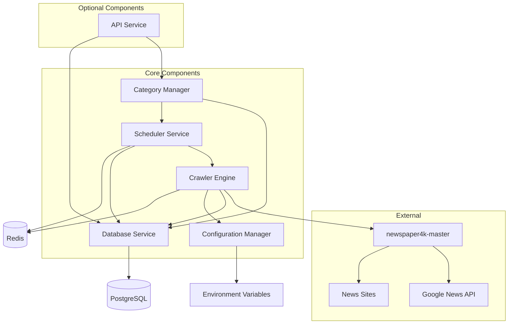

# Components

Định nghĩa các major logical components dựa trên architectural patterns, tech stack và data models đã thiết kế.

## System Component Overview



## Core Components

### Crawler Engine

**Responsibility:** Orchestrate việc crawling Google News sử dụng newspaper4k-master, handle rate limiting và error recovery

**Key Interfaces:**
- `crawl_category(category: Category) -> List[Article]` - Crawl articles cho một category
- `extract_article_content(url: str) -> ArticleContent` - Extract full content từ URL
- `apply_category_filters(articles: List[Article], category: Category) -> List[Article]` - Apply OR logic filtering

**Dependencies:** newspaper4k-master (GoogleNewsSource, extractors), Redis (rate limiting), PostgreSQL (deduplication check)

**Technology Stack:** Python 3.11+, newspaper4k-master, requests, tenacity (retry logic), redis-py

**Implementation Location:** `src/core/crawler/`
```
crawler/
├── engine.py          # Main crawler orchestration
├── extractor.py       # newspaper4k wrapper
├── rate_limiter.py    # Rate limiting logic
└── deduplicator.py    # Deduplication logic
```

### Scheduler Service

**Responsibility:** Quản lý scheduled crawling jobs, trigger crawl tasks theo lịch định kỳ, handle job queuing và monitoring

**Key Interfaces:**
- `schedule_crawl_job(category_id: UUID, schedule: str) -> CrawlJob` - Schedule periodic crawl
- `trigger_immediate_crawl(category_id: UUID) -> CrawlJob` - Manual trigger
- `get_job_status(job_id: UUID) -> CrawlJobStatus` - Monitor job progress

**Dependencies:** Celery (job queue), Redis (broker), Database Service (job persistence)

**Technology Stack:** Celery 5.3+, Redis, SQLAlchemy, APScheduler (fallback option)

**Implementation Location:** `src/core/scheduler/`
```
scheduler/
├── celery_app.py      # Celery configuration
├── tasks.py           # Celery tasks
└── cron_scheduler.py  # Periodic job setup
```

### Database Service

**Responsibility:** Handle tất cả database operations, migrations, data persistence và deduplication logic

**Key Interfaces:**
- `save_articles(articles: List[Article], category_id: UUID) -> int` - Bulk save với deduplication
- `get_articles_by_category(category_id: UUID, filters: Dict) -> List[Article]` - Query articles
- `manage_categories() -> CategoryCRUD` - Category management operations

**Dependencies:** PostgreSQL 15+, Alembic (migrations)

**Technology Stack:** SQLAlchemy 2.0+, Alembic, asyncpg (async PostgreSQL driver), Pydantic

**Implementation Location:** `src/database/`
```
database/
├── models/            # SQLAlchemy models
├── repositories/      # Data access layer
└── migrations/        # Alembic migrations
```

### Category Manager

**Responsibility:** Quản lý categories, keywords, validation logic và category-based search configuration

**Key Interfaces:**
- `create_category(name: str, keywords: List[str]) -> Category` - Create new category
- `update_keywords(category_id: UUID, keywords: List[str]) -> Category` - Update search terms
- `validate_category_config(category: Category) -> ValidationResult` - Validate OR logic setup

**Dependencies:** Database Service, Scheduler Service (trigger reschedule when updated)

**Technology Stack:** Pydantic (validation), SQLAlchemy

**Implementation Location:** `src/core/category/`
```
category/
├── manager.py         # Category business logic
├── validator.py       # Keywords validation
└── search_builder.py  # OR logic query builder
```

### Configuration Manager

**Responsibility:** Centralized configuration management, environment variables, rate limiting settings

**Key Interfaces:**
- `get_config(key: str) -> Any` - Get configuration value
- `update_crawl_settings(settings: Dict) -> None` - Runtime config updates
- `get_rate_limits() -> RateLimitConfig` - Get current rate limit settings

**Dependencies:** None (foundation component)

**Technology Stack:** Pydantic Settings, python-dotenv

**Implementation Location:** `src/shared/config.py`

## Optional Components

### API Service

**Responsibility:** Provide REST API endpoints cho category management, article browsing và system monitoring

**Key Interfaces:**
- REST endpoints theo OpenAPI spec đã define
- Authentication middleware (nếu cần)
- Request/response serialization

**Dependencies:** Database Service, Category Manager, Scheduler Service

**Technology Stack:** FastAPI 0.104+, Pydantic, uvicorn

**Implementation Location:** `src/api/`
```
api/
├── app.py             # FastAPI app setup
├── dependencies.py    # Shared dependencies
├── middleware.py      # Auth, CORS, logging
├── schemas/           # Pydantic models
└── routes/            # API endpoints
```

## Component Integration Patterns

### Repository Pattern Implementation

```python
# Base repository pattern
from abc import ABC, abstractmethod
from typing import Generic, TypeVar, List, Optional
from uuid import UUID

T = TypeVar('T')

class BaseRepository(Generic[T], ABC):
    def __init__(self, db_session):
        self.db = db_session
    
    @abstractmethod
    async def get_by_id(self, id: UUID) -> Optional[T]:
        pass
    
    @abstractmethod
    async def get_all(self, limit: int = 100) -> List[T]:
        pass
    
    @abstractmethod
    async def create(self, **kwargs) -> T:
        pass
    
    @abstractmethod
    async def update_by_id(self, id: UUID, **kwargs) -> Optional[T]:
        pass
    
    @abstractmethod
    async def delete_by_id(self, id: UUID) -> bool:
        pass
```

### Service Layer Pattern

```python
# Category service example
class CategoryService:
    def __init__(
        self, 
        repository: CategoryRepository,
        scheduler: SchedulerService,
        logger: Logger
    ):
        self.repository = repository
        self.scheduler = scheduler
        self.logger = logger
    
    async def create_category(
        self, 
        name: str, 
        keywords: List[str]
    ) -> Category:
        # Validation
        self._validate_keywords(keywords)
        
        # Check duplicates
        existing = await self.repository.get_by_name(name)
        if existing:
            raise CategoryAlreadyExistsError(name)
        
        # Create category
        category = await self.repository.create(
            name=name,
            keywords=keywords
        )
        
        # Schedule initial crawl
        await self.scheduler.schedule_crawl(category.id)
        
        self.logger.info(f"Category created: {name}")
        return category
```

### Dependency Injection Pattern

```python
# FastAPI dependency injection
from fastapi import Depends
from sqlalchemy.ext.asyncio import AsyncSession

def get_db_session() -> AsyncSession:
    # Return database session
    pass

def get_category_repository(
    db: AsyncSession = Depends(get_db_session)
) -> CategoryRepository:
    return CategoryRepository(db)

def get_category_service(
    repository: CategoryRepository = Depends(get_category_repository)
) -> CategoryService:
    return CategoryService(repository)

# Usage trong API routes
@router.post("/categories")
async def create_category(
    request: CreateCategoryRequest,
    service: CategoryService = Depends(get_category_service)
):
    return await service.create_category(
        name=request.name,
        keywords=request.keywords
    )
```

## Component Communication

### Event-Driven Communication

```python
# Event system for loose coupling
from typing import Dict, Any
from abc import ABC, abstractmethod

class Event(ABC):
    pass

class CategoryCreatedEvent(Event):
    def __init__(self, category_id: UUID, name: str):
        self.category_id = category_id
        self.name = name

class EventHandler(ABC):
    @abstractmethod
    async def handle(self, event: Event) -> None:
        pass

class SchedulerEventHandler(EventHandler):
    def __init__(self, scheduler_service):
        self.scheduler = scheduler_service
    
    async def handle(self, event: Event) -> None:
        if isinstance(event, CategoryCreatedEvent):
            await self.scheduler.schedule_initial_crawl(
                event.category_id
            )

class EventBus:
    def __init__(self):
        self.handlers: Dict[type, List[EventHandler]] = {}
    
    def subscribe(self, event_type: type, handler: EventHandler):
        if event_type not in self.handlers:
            self.handlers[event_type] = []
        self.handlers[event_type].append(handler)
    
    async def publish(self, event: Event):
        handlers = self.handlers.get(type(event), [])
        for handler in handlers:
            await handler.handle(event)
```

## Component Health Checks

```python
class ComponentHealthChecker:
    def __init__(self, components: Dict[str, Any]):
        self.components = components
    
    async def check_all_components(self) -> Dict[str, str]:
        results = {}
        
        for name, component in self.components.items():
            try:
                if hasattr(component, 'health_check'):
                    await component.health_check()
                    results[name] = "healthy"
                else:
                    results[name] = "unknown"
            except Exception as e:
                results[name] = f"unhealthy: {str(e)}"
        
        return results
```

## Design Principles

1. **Separation of Concerns:** Mỗi component có responsibility rõ ràng
2. **Dependency Injection:** Loose coupling through constructor injection
3. **Interface Segregation:** Small, focused interfaces
4. **Single Responsibility:** Each component handles one major concern
5. **Open/Closed Principle:** Components open for extension, closed for modification
6. **Event-Driven Architecture:** Loose coupling through events
7. **Repository Pattern:** Abstract data access layer
8. **Service Layer:** Business logic separation