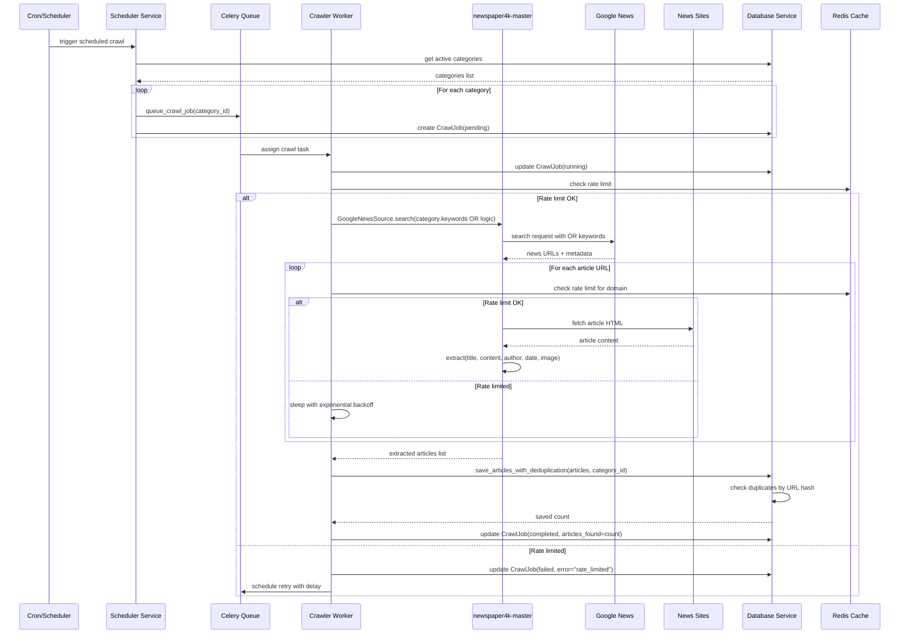
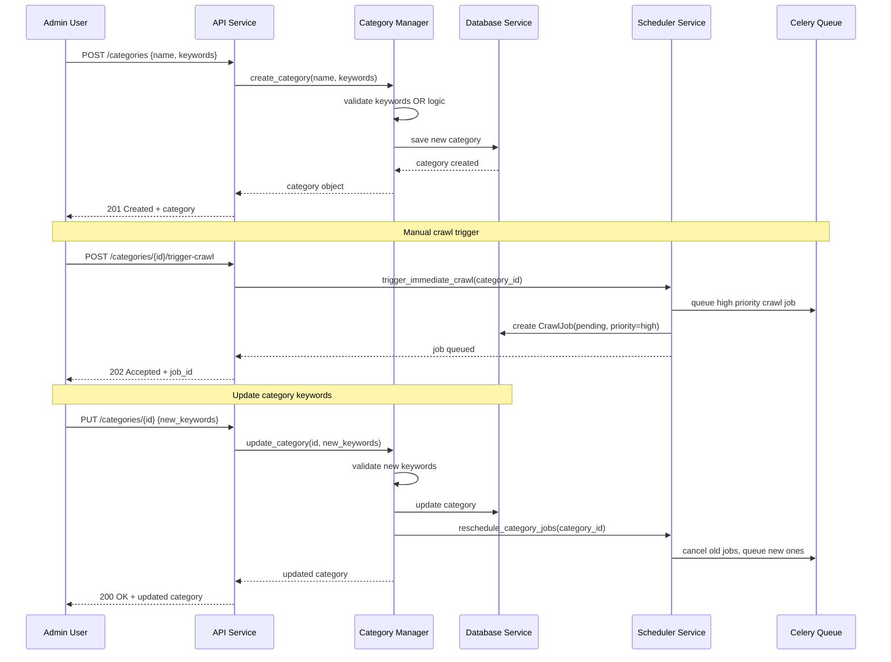
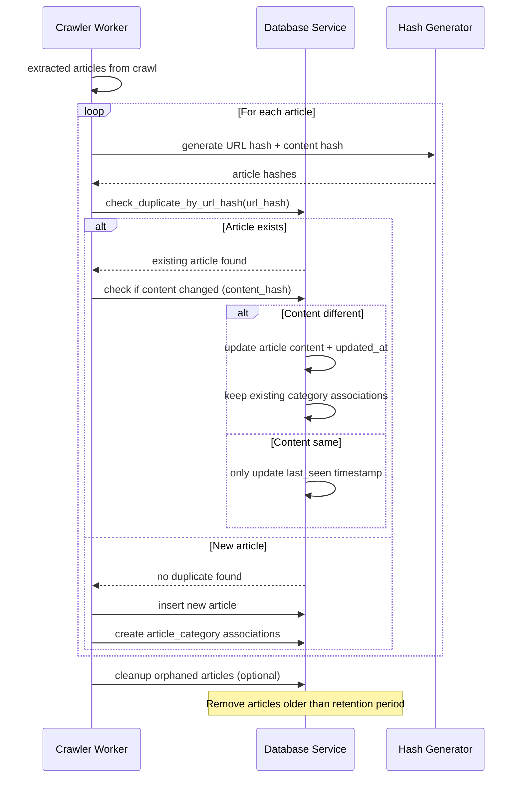
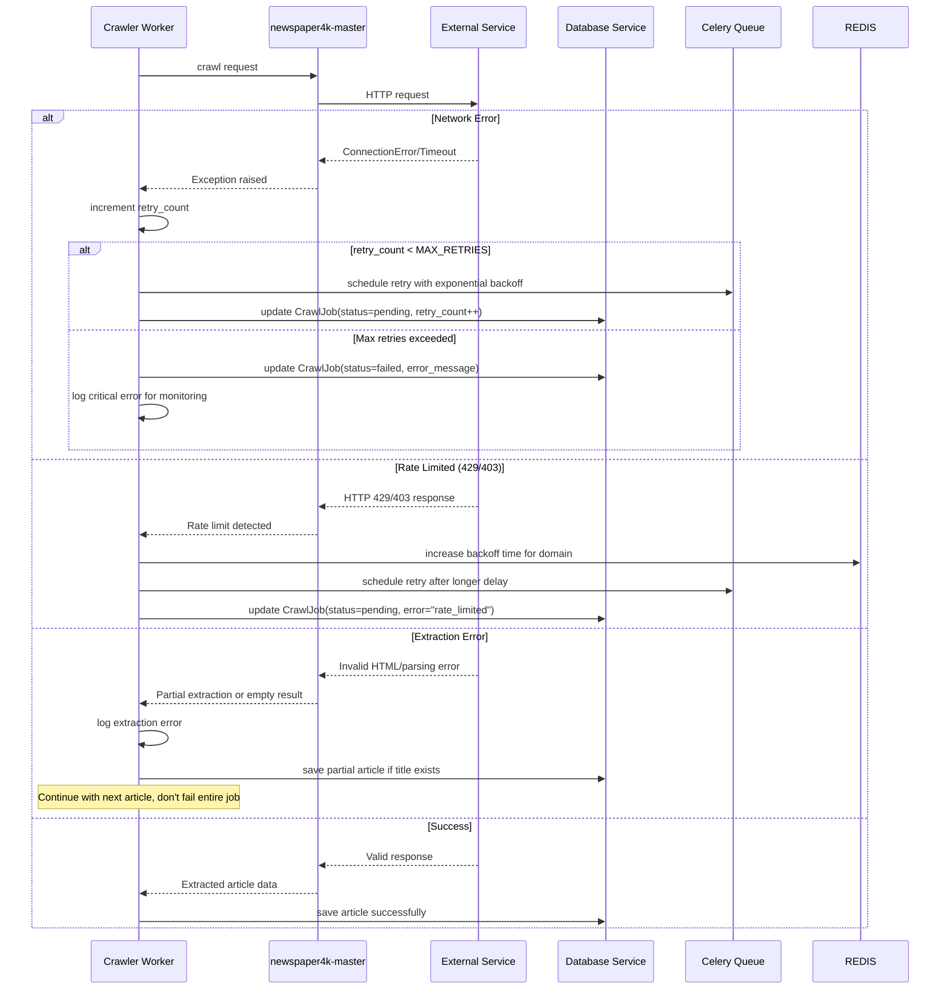
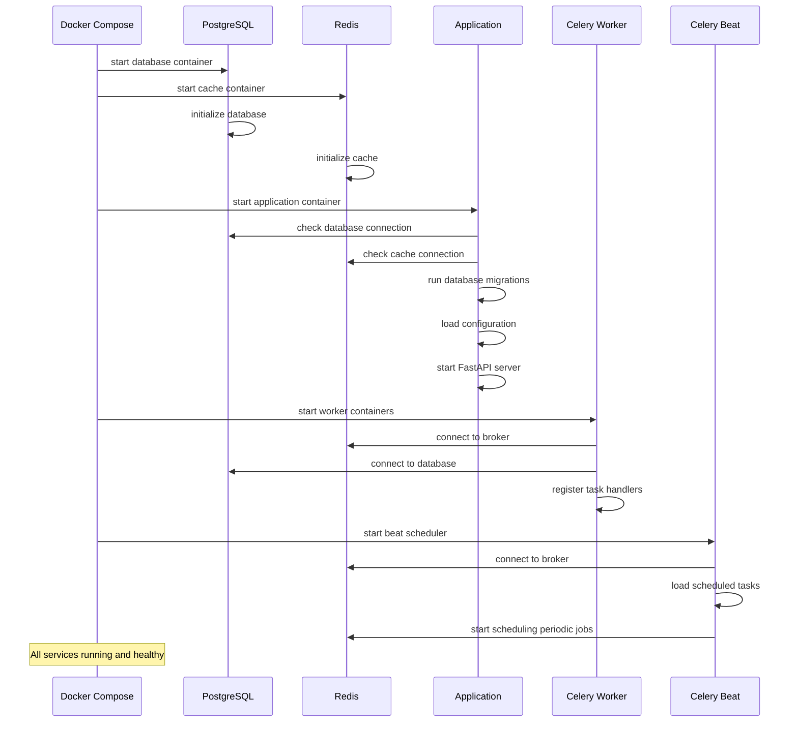

# Core Workflows

Minh họa các key system workflows bằng sequence diagrams cho critical user journeys từ PRD.

## Workflow 1: Scheduled Category Crawling

## Workflow 2: Manual Category Management

## Workflow 3: Article Deduplication Flow

## Workflow 4: Error Handling & Retry Flow

## Workflow 5: System Startup & Initialization

## Key Workflow Principles

1. **Asynchronous Processing:** Scheduler không block chờ crawl completion
2. **Graceful Error Handling:** Different strategies cho different error types
3. **Rate Limiting Respect:** Multiple checkpoints để avoid getting blocked
4. **Deduplication Efficiency:** Hash-based checking before expensive database operations
5. **Retry Logic:** Exponential backoff với max attempts để avoid infinite loops
6. **Status Tracking:** Comprehensive job status updates for monitoring
7. **Resource Management:** Cleanup và memory management trong long-running processes