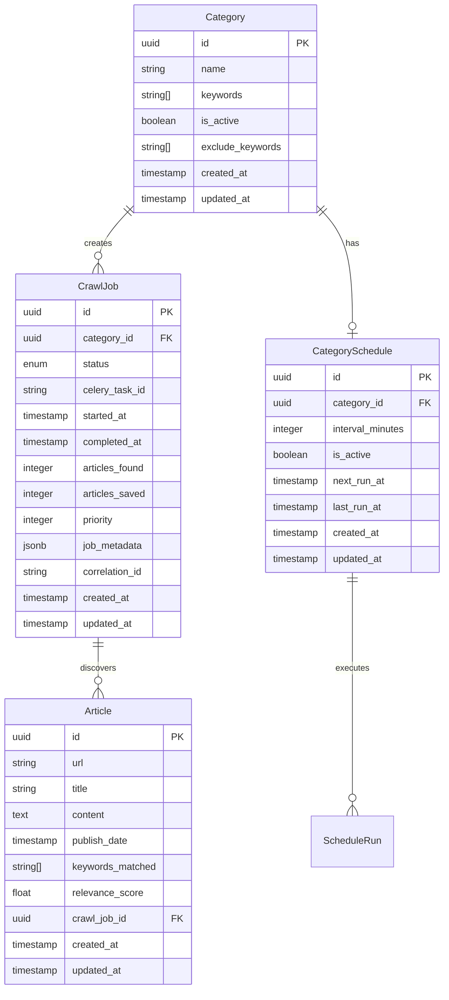

# Data Models

## Overview

This document defines the core data models/entities that are shared between frontend and backend for the Google News Scraper job-centric enhancement. These models support the primary use cases of job management, article viewing, and integrated scheduling.

## Core Data Models

### CrawlJob

**Purpose:** Tracks individual crawling operations with status, metrics, and job configuration. Central to the job-centric architecture.

**Key Attributes:**
- id: UUID - Unique job identifier
- category_id: UUID - Reference to crawled category
- status: Enum - Current job state (pending/running/completed/failed)
- celery_task_id: String - Celery task tracking ID
- started_at/completed_at: DateTime - Job execution timing
- articles_found/articles_saved: Integer - Job success metrics
- priority: Integer - Queue priority for "Run Now" functionality
- correlation_id: String - Request tracing across services

#### TypeScript Interface

```typescript
export interface CrawlJob {
  id: string;
  category_id: string;
  status: 'pending' | 'running' | 'completed' | 'failed';
  celery_task_id?: string;
  started_at?: string;
  completed_at?: string;
  articles_found: number;
  articles_saved: number;
  error_message?: string;
  retry_count: number;
  priority: number;
  job_metadata?: Record<string, any>;
  correlation_id?: string;
  created_at: string;
  updated_at: string;
}

export enum CrawlJobStatus {
  PENDING = 'pending',
  RUNNING = 'running',
  COMPLETED = 'completed',
  FAILED = 'failed'
}
```

#### Relationships
- Belongs to one Category
- Associated with multiple Articles through job execution
- Tracked by Celery task system

### Category

**Purpose:** Defines news categories with keywords and scheduling configuration for automated crawling

**Key Attributes:**
- id: UUID - Unique category identifier
- name: String - Category display name
- keywords: String[] - Search terms for crawling
- is_active: Boolean - Category activation status
- exclude_keywords: String[] - Terms to filter out
- schedule_config: Object - Auto-crawl scheduling settings

#### TypeScript Interface

```typescript
export interface Category {
  id: string;
  name: string;
  keywords: string[];
  is_active: boolean;
  exclude_keywords?: string[];
  created_at: string;
  updated_at: string;
}

export interface CategoryWithSchedule extends Category {
  schedule?: CategorySchedule;
  next_run_display?: string;
  last_crawl_time?: string;
}
```

#### Relationships
- Has many CrawlJobs
- Has one CategorySchedule (optional)
- Associated with Articles through crawl jobs

### CategorySchedule

**Purpose:** Manages automated crawling schedules for categories with Celery Beat integration

**Key Attributes:**
- id: UUID - Unique schedule identifier
- category_id: UUID - Reference to category
- interval_minutes: Integer - Crawling interval
- is_active: Boolean - Schedule activation status
- next_run_at: DateTime - Next scheduled execution
- last_run_at: DateTime - Last execution time

#### TypeScript Interface

```typescript
export interface CategorySchedule {
  id: string;
  category_id: string;
  interval_minutes: number;
  is_active: boolean;
  next_run_at?: string;
  last_run_at?: string;
  created_at: string;
  updated_at: string;
}

export interface ScheduleRun {
  id: string;
  schedule_id: string;
  executed_at: string;
  status: 'success' | 'failed';
  job_id?: string;
  error_message?: string;
}

export interface CategoryScheduleWithHistory extends CategorySchedule {
  run_history: ScheduleRun[];
  next_run_display: string;
}
```

#### Relationships
- Belongs to one Category
- Creates CrawlJobs through scheduled execution
- Tracks execution history

### Article

**Purpose:** Stores crawled news articles with metadata and content, linked to specific crawl jobs

**Key Attributes:**
- id: UUID - Unique article identifier
- url: String - Original article URL
- title: String - Article headline
- content: Text - Full article content
- publish_date: DateTime - Article publication date
- crawl_job_id: UUID - Job that found this article
- keywords_matched: String[] - Keywords that matched during crawling
- relevance_score: Float - Article relevance rating

#### TypeScript Interface

```typescript
export interface Article {
  id: string;
  url: string;
  title: string;
  content: string;
  summary?: string;
  publish_date: string;
  author?: string;
  image_url?: string;
  keywords_matched: string[];
  relevance_score: number;
  crawl_job_id?: string;
  created_at: string;
  updated_at: string;
}

export interface ArticleWithJobInfo extends Article {
  job?: {
    id: string;
    category_name: string;
    crawl_date: string;
  };
}
```

#### Relationships
- Belongs to one or more Categories (many-to-many)
- Associated with CrawlJob that discovered it
- Can have multiple keyword matches

## Supporting Types

### Pagination and Filtering

```typescript
export interface PaginatedResponse<T> {
  items: T[];
  total: number;
  page: number;
  pages: number;
  size: number;
}

export interface JobFilters {
  status?: CrawlJobStatus;
  category_id?: string;
  priority_min?: number;
  date_from?: string;
  date_to?: string;
}

export interface ArticleFilters {
  job_id?: string;
  category_id?: string;
  search?: string;
  date_from?: string;
  date_to?: string;
  relevance_min?: number;
}
```

### Export and API Types

```typescript
export interface ExportRequest {
  job_id?: string;
  category_id?: string;
  format: 'json' | 'csv' | 'xlsx';
  fields?: string[];
  filters?: ArticleFilters;
}

export interface JobUpdateRequest {
  priority?: number;
  retry_count?: number;
  job_metadata?: Record<string, any>;
}

export interface PriorityUpdateRequest {
  priority: number;
}

export interface ScheduleCreateRequest {
  category_id: string;
  interval_minutes: number;
  is_active: boolean;
}
```

## Database Schema Relationships



## Model Validation Rules

### CrawlJob Constraints
- `articles_found >= 0`
- `articles_saved >= 0`
- `articles_saved <= articles_found`
- `retry_count >= 0 AND retry_count <= 10`
- `priority >= 0`
- Status-dependent timestamp validation

### Category Constraints
- `name` must be unique and non-empty
- `keywords` array must contain at least one non-empty string
- `exclude_keywords` array elements must be non-empty strings

### CategorySchedule Constraints
- `interval_minutes >= 15` (minimum 15-minute intervals)
- `interval_minutes <= 10080` (maximum weekly intervals)
- Unique constraint on `category_id`
- `next_run_at` must be in the future when active

### Article Constraints
- `url` must be valid URL format
- `title` and `content` must be non-empty
- `relevance_score >= 0.0 AND relevance_score <= 1.0`
- `publish_date` must not be in the future