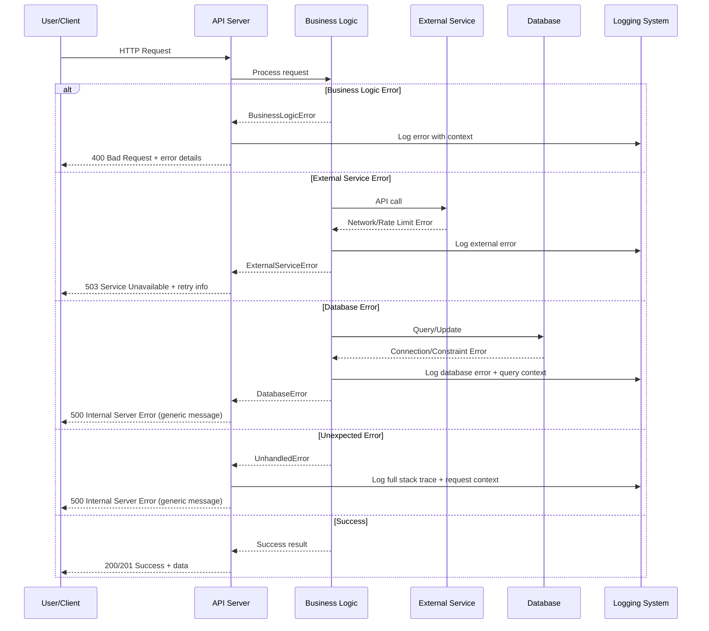

# Error Handling Strategy

Define unified error handling across frontend và backend với consistent user experience.

## Error Response Format

```typescript
interface ApiError {
  error: {
    code: string;                    // Machine-readable error code
    message: string;                 // Human-readable message
    details?: Record<string, any>;   // Additional error context
    timestamp: string;               // ISO 8601 timestamp
    requestId: string;               // Correlation ID for tracing
    retryable?: boolean;             // Can client retry this request?
    retryAfter?: number;             // Seconds to wait before retry
  };
}

// Examples
{
  "error": {
    "code": "CATEGORY_VALIDATION_FAILED",
    "message": "Category validation failed",
    "details": {
      "field": "keywords",
      "reason": "Keywords list cannot be empty"
    },
    "timestamp": "2024-01-15T10:30:00Z",
    "requestId": "req_123456789",
    "retryable": false
  }
}
```

## Error Codes Hierarchy

```python
from enum import Enum

class ErrorCode(str, Enum):
    # Business logic errors
    CATEGORY_NOT_FOUND = "CATEGORY_NOT_FOUND"
    CATEGORY_VALIDATION_FAILED = "CATEGORY_VALIDATION_FAILED" 
    DUPLICATE_CATEGORY_NAME = "DUPLICATE_CATEGORY_NAME"
    INVALID_KEYWORDS = "INVALID_KEYWORDS"
    
    # External service errors
    GOOGLE_NEWS_UNAVAILABLE = "GOOGLE_NEWS_UNAVAILABLE"
    RATE_LIMIT_EXCEEDED = "RATE_LIMIT_EXCEEDED"
    EXTRACTION_FAILED = "EXTRACTION_FAILED"
    
    # Infrastructure errors
    DATABASE_CONNECTION_ERROR = "DATABASE_CONNECTION_ERROR"
    REDIS_CONNECTION_ERROR = "REDIS_CONNECTION_ERROR"
    CELERY_TASK_FAILED = "CELERY_TASK_FAILED"
    
    # Generic errors
    INTERNAL_SERVER_ERROR = "INTERNAL_SERVER_ERROR"
    VALIDATION_ERROR = "VALIDATION_ERROR"
```

## Custom Exception Classes

```python
class BaseAppException(Exception):
    """Base exception class cho application"""
    
    def __init__(
        self,
        code: ErrorCode,
        message: str,
        details: Optional[Dict[str, Any]] = None,
        retryable: bool = False,
        retry_after: Optional[int] = None
    ):
        self.code = code
        self.message = message
        self.details = details or {}
        self.retryable = retryable
        self.retry_after = retry_after
        super().__init__(message)

class CategoryValidationError(BaseAppException):
    def __init__(self, message: str, field: str = None):
        super().__init__(
            code=ErrorCode.CATEGORY_VALIDATION_FAILED,
            message=message,
            details={"field": field} if field else {},
            retryable=False
        )

class ExternalServiceError(BaseAppException):
    def __init__(self, service: str, status_code: int = None, retry_after: int = None):
        super().__init__(
            code=ErrorCode.GOOGLE_NEWS_UNAVAILABLE if service == "google_news" else ErrorCode.EXTERNAL_SERVICE_UNAVAILABLE,
            message=f"{service} service is temporarily unavailable",
            details={"service": service, "statusCode": status_code},
            retryable=True,
            retry_after=retry_after
        )

class RateLimitExceededError(BaseAppException):
    def __init__(self, service: str, retry_after: int = 60):
        super().__init__(
            code=ErrorCode.RATE_LIMIT_EXCEEDED,
            message=f"Rate limit exceeded for {service}",
            details={"service": service},
            retryable=True,
            retry_after=retry_after
        )
```

## Global Exception Handler

```python
from fastapi import Request, HTTPException
from fastapi.responses import JSONResponse
from starlette.status import HTTP_500_INTERNAL_SERVER_ERROR
import traceback
import uuid
from datetime import datetime, timezone

async def global_exception_handler(request: Request, exc: Exception) -> JSONResponse:
    """Global exception handler cho FastAPI"""
    
    # Generate correlation ID
    request_id = getattr(request.state, 'request_id', str(uuid.uuid4()))
    timestamp = datetime.now(timezone.utc).isoformat()
    
    # Handle custom application exceptions
    if isinstance(exc, BaseAppException):
        status_code = 400 if exc.code in [
            ErrorCode.CATEGORY_VALIDATION_FAILED,
            ErrorCode.INVALID_KEYWORDS,
            ErrorCode.VALIDATION_ERROR
        ] else 503 if exc.retryable else 500
        
        response_data = {
            "error": {
                "code": exc.code,
                "message": exc.message,
                "details": exc.details,
                "timestamp": timestamp,
                "requestId": request_id,
                "retryable": exc.retryable
            }
        }
        
        if exc.retry_after:
            response_data["error"]["retryAfter"] = exc.retry_after
        
        # Log error với appropriate level
        log_level = "warning" if status_code < 500 else "error"
        logger.log(
            getattr(logging, log_level.upper()),
            f"Application error: {exc.message}",
            extra={
                "error_code": exc.code,
                "request_id": request_id,
                "details": exc.details,
                "path": str(request.url),
                "method": request.method
            }
        )
        
        return JSONResponse(
            status_code=status_code,
            content=response_data
        )
    
    # Handle HTTP exceptions
    elif isinstance(exc, HTTPException):
        return JSONResponse(
            status_code=exc.status_code,
            content={
                "error": {
                    "code": f"HTTP_{exc.status_code}",
                    "message": exc.detail,
                    "timestamp": timestamp,
                    "requestId": request_id,
                    "retryable": False
                }
            }
        )
    
    # Handle unexpected exceptions
    else:
        # Log full error với stack trace
        logger.error(
            f"Unhandled exception: {str(exc)}",
            extra={
                "error_type": type(exc).__name__,
                "request_id": request_id,
                "path": str(request.url),
                "method": request.method,
                "stack_trace": traceback.format_exc()
            }
        )
        
        return JSONResponse(
            status_code=HTTP_500_INTERNAL_SERVER_ERROR,
            content={
                "error": {
                    "code": ErrorCode.INTERNAL_SERVER_ERROR,
                    "message": "An internal server error occurred",
                    "timestamp": timestamp,
                    "requestId": request_id,
                    "retryable": False
                }
            }
        )
```

## Celery Error Handling

```python
@celery_app.task(bind=True, max_retries=3)
def crawl_category_task(self, category_id: str):
    request_id = str(uuid.uuid4())
    
    try:
        logger.info(f"Starting crawl task", extra={
            "task_id": self.request.id,
            "category_id": category_id,
            "request_id": request_id,
            "attempt": self.request.retries + 1
        })
        
        # Update job status
        job_repo = CrawlJobRepository()
        await job_repo.update_status(
            self.request.id,
            "running",
            started_at=datetime.utcnow()
        )
        
        # Execute crawl
        crawler = CrawlerEngine()
        result = await crawler.crawl_category(UUID(category_id))
        
        # Success
        await job_repo.update_status(
            self.request.id,
            "completed",
            completed_at=datetime.utcnow(),
            articles_found=result["article_count"]
        )
        
        return result
        
    except RateLimitExceededError as e:
        logger.warning(f"Rate limit exceeded, retrying", extra={
            "task_id": self.request.id,
            "request_id": request_id,
            "retry_after": e.retry_after
        })
        
        # Retry with specified delay
        raise self.retry(countdown=e.retry_after or 60)
        
    except ExternalServiceError as e:
        if self.request.retries < self.max_retries:
            logger.warning(f"External service error, retrying", extra={
                "task_id": self.request.id,
                "request_id": request_id,
                "service": e.details.get("service"),
                "attempt": self.request.retries + 1
            })
            
            # Exponential backoff
            countdown = min(60 * (2 ** self.request.retries), 300)  # Max 5 minutes
            raise self.retry(countdown=countdown)
        else:
            # Max retries exceeded
            logger.error(f"External service permanently unavailable", extra={
                "task_id": self.request.id,
                "request_id": request_id,
                "max_retries_exceeded": True
            })
            
            await job_repo.update_status(
                self.request.id,
                "failed",
                error_message=e.message,
                completed_at=datetime.utcnow()
            )
            
            raise
            
    except Exception as e:
        logger.error(f"Task failed with unexpected error", extra={
            "task_id": self.request.id,
            "request_id": request_id,
            "error": str(e),
            "error_type": type(e).__name__,
            "stack_trace": traceback.format_exc()
        })
        
        await job_repo.update_status(
            self.request.id,
            "failed",
            error_message=f"Unexpected error: {str(e)}",
            completed_at=datetime.utcnow()
        )
        
        # Don't retry unexpected errors
        raise
```

## Error Flow Sequence



## Frontend Error Handling (Future)

```typescript
// Error handling service
class ErrorHandler {
  private notificationService: NotificationService;
  
  constructor(notificationService: NotificationService) {
    this.notificationService = notificationService;
  }
  
  handleApiError(error: ApiError): void {
    const { code, message, retryable, retryAfter } = error.error;
    
    switch (code) {
      case 'CATEGORY_VALIDATION_FAILED':
        this.showValidationError(message, error.error.details);
        break;
        
      case 'RATE_LIMIT_EXCEEDED':
        this.showRateLimitError(retryAfter || 60);
        break;
        
      case 'EXTERNAL_SERVICE_UNAVAILABLE':
        this.showServiceUnavailableError(retryable, retryAfter);
        break;
        
      default:
        if (retryable) {
          this.showRetryableError(message, retryAfter);
        } else {
          this.showGenericError(message);
        }
    }
  }
  
  private showValidationError(message: string, details?: any): void {
    this.notificationService.showError({
      title: 'Validation Error',
      message,
      type: 'validation',
      persistent: true
    });
  }
}
```

## Circuit Breaker Pattern

```python
class CircuitBreaker:
    def __init__(self, failure_threshold=5, recovery_timeout=300):
        self.failure_threshold = failure_threshold
        self.recovery_timeout = recovery_timeout
        self.failure_count = 0
        self.last_failure_time = None
        self.state = "closed"  # closed, open, half-open
    
    async def call(self, func, *args, **kwargs):
        if self.state == "open":
            if time.time() - self.last_failure_time > self.recovery_timeout:
                self.state = "half-open"
            else:
                raise CircuitBreakerOpenError("Circuit breaker is open")
        
        try:
            result = await func(*args, **kwargs)
            self.record_success()
            return result
        except Exception as e:
            self.record_failure()
            raise e
    
    def record_success(self):
        self.failure_count = 0
        self.state = "closed"
    
    def record_failure(self):
        self.failure_count += 1
        self.last_failure_time = time.time()
        
        if self.failure_count >= self.failure_threshold:
            self.state = "open"
```

## Error Recovery Strategies

### Retry with Exponential Backoff

```python
import asyncio
import random
from typing import Callable, Any, Optional

async def retry_with_backoff(
    func: Callable,
    max_retries: int = 3,
    initial_delay: float = 1.0,
    max_delay: float = 60.0,
    exponential_base: float = 2.0,
    jitter: bool = True,
    retryable_exceptions: tuple = (Exception,)
) -> Any:
    """Retry function với exponential backoff và jitter"""
    
    for attempt in range(max_retries + 1):
        try:
            return await func()
        except retryable_exceptions as e:
            if attempt == max_retries:
                raise e
            
            # Calculate delay với exponential backoff
            delay = min(initial_delay * (exponential_base ** attempt), max_delay)
            
            # Add jitter to prevent thundering herd
            if jitter:
                delay *= (0.5 + random.random() / 2)
            
            logger.warning(f"Attempt {attempt + 1} failed: {e}. Retrying in {delay:.2f}s")
            await asyncio.sleep(delay)
    
    raise Exception("Max retries exceeded")
```

## Best Practices

1. **Structured Error Responses:** Consistent format cho easy client handling
2. **Error Classification:** Different handling strategies cho different error types
3. **Correlation IDs:** Track errors across services và logs
4. **Retry Logic:** Automatic retry cho transient failures
5. **User-friendly Messages:** Hide technical details từ end users
6. **Comprehensive Logging:** Full context cho debugging production issues
7. **Circuit Breakers:** Prevent cascading failures
8. **Graceful Degradation:** Partial functionality when services fail