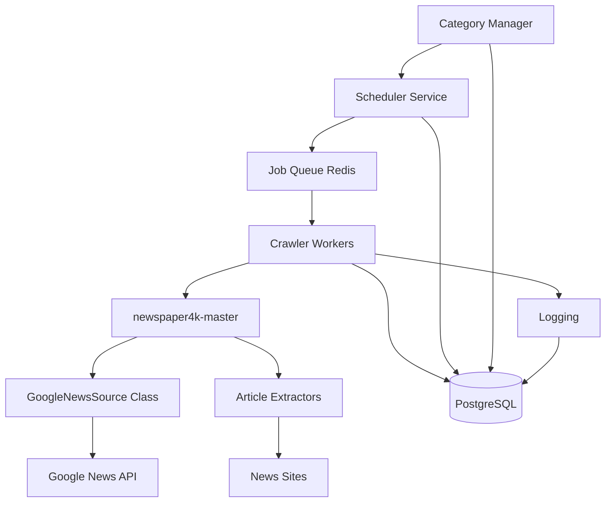

# High Level Architecture

## Technical Summary

Google News Scraper tận dụng hoàn toàn newspaper4k-master codebase hiện có (đã bao gồm GoogleNewsSource và crawling functionality). Hệ thống chỉ cần extend với database layer (PostgreSQL), scheduling mechanism (Celery/APScheduler), và category management system. Local development environment với Docker, sau này deploy lên VPS. Architecture đơn giản: scheduler triggers crawl jobs, newspaper4k-master handles Google News crawling và article extraction, results được store vào PostgreSQL theo categories.

## Platform and Infrastructure Choice

**Current Phase: Local Development**
- **Platform:** Local Docker environment  
- **Key Services:** PostgreSQL container, Redis container (job queue), Python application
- **Development Host:** Local machine với Docker Compose

**Future Phase: VPS Deployment**
- **Platform:** VPS (DigitalOcean/AWS EC2) với Docker
- **Key Services:** PostgreSQL, Redis, Nginx reverse proxy
- **Deployment Regions:** Tùy chọn (có thể Asia-Pacific)

## Repository Structure

**Structure:** Monorepo extending newspaper4k-master
**Organization:** 
```
google-news-scraper/
├── newspaper4k-master/     # Existing codebase (GoogleNewsSource, crawlers)
├── src/
│   ├── scheduler/         # Job scheduling logic
│   ├── database/          # PostgreSQL models, migrations  
│   ├── categories/        # Category management
│   └── config/           # Configuration management
├── docker-compose.yml     # Local development
└── requirements.txt       # Additional dependencies
```

## High Level Architecture Diagram



## Architectural Patterns

- **Wrapper Pattern:** Wrap newspaper4k-master functionality cho database integration - _Rationale:_ Không modify existing codebase, chỉ extend
- **Job Queue Pattern:** Redis + workers cho scheduled crawling - _Rationale:_ newspaper4k-master đã handle crawling, chỉ cần orchestrate
- **Category-Based Processing:** OR logic cho multiple keywords per category - _Rationale:_ Leverage GoogleNewsSource filtering capabilities
- **Configuration-Driven:** Categories và keywords trong database, configurable - _Rationale:_ Dynamic management không cần code changes