# High Level Architecture

## Technical Summary

The Google News Scraper employs a **brownfield microservices architecture** with the addition of a new standalone frontend layer. The existing FastAPI backend provides robust REST APIs consumed by both the current Swagger UI and the new React-based web interface. The system utilizes a containerized deployment model with Docker Compose orchestrating PostgreSQL database, Redis cache/message broker, Celery workers for background crawling tasks, and the new Node.js frontend service. This architecture achieves the PRD goal of providing a user-friendly web interface while maintaining the proven stability and performance of the existing backend infrastructure.

## Platform and Infrastructure Choice

**Platform:** Docker-based containerized architecture with potential cloud deployment
**Key Services:** FastAPI backend, PostgreSQL database, Redis cache/broker, Celery workers, Node.js frontend
**Deployment Host and Regions:** Local development with Docker Compose, production deployment flexible (AWS, Azure, or GCP)

## Repository Structure

**Structure:** Monorepo with clear separation between frontend and backend
**Monorepo Tool:** Standard directory organization (no additional tooling required initially)
**Package Organization:** 
- `/src` - Existing FastAPI backend
- `/frontend` - New Node.js web interface
- `/docs` - Shared documentation
- `/docker` - Containerization configurations

## High Level Architecture Diagram

### Current Implementation Status

```mermaid
graph TB
    A[User Browser] -->|HTTP:3000| B[Frontend Container<br/>Vite + React + TypeScript]
    B -->|REST API<br/>http://localhost:8000| C[FastAPI Backend<br/>Port 8000]
    C --> D[PostgreSQL<br/>Database Port 5432]
    C --> E[Redis<br/>Cache/Message Broker Port 6379]
    C --> F[Celery Workers<br/>Background Tasks]
    C --> G[Celery Beat<br/>Scheduler]
    F --> H[Google News API<br/>External Service]
    F --> |newspaper4k| I[Article Extraction<br/>Library]
    I[Swagger UI<br/>/api/v1/docs] -->|REST API| C
    J[Developer Tools] -->|Direct Access| D
    J -->|Monitoring| K[Flower<br/>Celery Monitor Port 5555]
    E --> F
    E --> G

    %% Implementation Status Colors
    style B fill:#4caf50,color:#ffffff %% ✅ Completed
    style C fill:#4caf50,color:#ffffff %% ✅ Completed
    style D fill:#4caf50,color:#ffffff %% ✅ Completed
    style E fill:#4caf50,color:#ffffff %% ✅ Completed
    style F fill:#ff9800,color:#ffffff %% 🔧 Partial
    style G fill:#4caf50,color:#ffffff %% ✅ Completed
    style H fill:#4caf50,color:#ffffff %% ✅ Completed
    style I fill:#4caf50,color:#ffffff %% ✅ Completed

    %% Add status indicators
    B -.->|"✅ Categories UI<br/>🔧 Jobs UI Missing<br/>❌ Articles UI Missing"| B1[Status]
    C -.->|"✅ Categories API<br/>✅ Health Endpoints<br/>❌ Jobs API Missing<br/>❌ Articles API Missing"| C1[Status]
    F -.->|"✅ Crawl Tasks<br/>✅ Job Tracking<br/>❌ API Endpoints Missing"| F1[Status]
```

### Data Flow Architecture

```mermaid
sequenceDiagram
    participant U as User Browser
    participant F as Frontend (React)
    participant A as FastAPI Backend
    participant D as PostgreSQL DB
    participant R as Redis
    participant W as Celery Worker
    participant G as Google News API

    Note over U,G: ✅ IMPLEMENTED: Categories Management Flow
    U->>F: Create Category
    F->>A: POST /api/v1/categories
    A->>D: INSERT category
    D-->>A: Category created
    A-->>F: CategoryResponse
    F-->>U: Success notification

    Note over U,G: 🔧 PARTIAL: Job Triggering Flow
    U->>F: Trigger Crawl Job
    F->>A: POST /api/v1/jobs (❌ Not implemented)
    A->>R: Queue crawl task
    A->>D: Create job record
    R->>W: Execute crawl_category_task
    W->>G: Fetch news articles
    G-->>W: Article data
    W->>D: Store articles
    W->>D: Update job status

    Note over U,G: ❌ NOT IMPLEMENTED: Articles Viewing Flow
    U->>F: View Articles
    F->>A: GET /api/v1/articles (❌ Not implemented)
    A->>D: Query articles (❌ Repository methods missing)
    D-->>A: Article list
    A-->>F: ArticleListResponse
    F-->>U: Display articles
```



## Architectural Patterns

### **✅ IMPLEMENTED PATTERNS**

- **Microservices Architecture:** Containerized services with clear boundaries - _Rationale:_ Existing proven architecture that enables independent scaling and maintenance of each service component
  - **Status**: ✅ **Fully Operational** - Docker Compose orchestrates 5 services (frontend, backend, database, redis, celery)
  - **Evidence**: `docker-compose.yml` with proper service separation and networking

- **API Gateway Pattern:** FastAPI serves as single entry point for all frontend requests - _Rationale:_ Centralized authentication, CORS handling, and request routing while maintaining existing API contracts
  - **Status**: ✅ **Fully Implemented** - Complete middleware stack with CORS, error handling, structured logging
  - **Evidence**: `src/api/main.py` with comprehensive middleware configuration

- **Repository Pattern:** Data access abstraction in backend - _Rationale:_ Already implemented in existing codebase, enables testing and future database flexibility
  - **Status**: ✅ **Fully Implemented** - CategoryRepository, CrawlJobRepository with async patterns
  - **Gaps**: ❌ ArticleRepository methods incomplete for API endpoints

- **Component-Based UI:** React components with TypeScript - _Rationale:_ Maintainability and type safety for complex admin interface interactions
  - **Status**: ✅ **Well Implemented** - Shadcn UI components, comprehensive TypeScript interfaces
  - **Evidence**: `frontend/src/components/features/categories/` with full CRUD component suite

- **Background Task Pattern:** Celery workers for crawling operations - _Rationale:_ Existing proven implementation for handling long-running crawl operations without blocking API responses
  - **Status**: ✅ **Advanced Implementation** - Comprehensive error handling, retry logic, correlation ID tracking
  - **Evidence**: `src/core/scheduler/tasks.py` with enterprise-grade task management

### **🔧 PARTIALLY IMPLEMENTED PATTERNS**

- **API-First Design:** REST API contracts define frontend-backend integration
  - **Status**: 🔧 **Partial** - Categories API complete, Jobs/Articles APIs missing
  - **Gap**: Missing `/api/v1/jobs` and `/api/v1/articles` endpoint implementations

- **State Management Pattern:** Client-side state management for UI components
  - **Status**: 🔧 **Basic Implementation** - React useState/useContext for categories
  - **Gap**: Need robust state management for jobs polling and articles pagination

### **❌ MISSING PATTERNS**

- **Real-time Communication:** WebSocket or Server-Sent Events for job status updates
  - **Current**: Polling-based approach planned
  - **Alternative**: HTTP polling with optimized intervals

- **Caching Strategy:** API response caching and browser-side caching
  - **Status**: ❌ **Not Implemented** - No HTTP caching headers or client-side caching
  - **Need**: Categories caching, paginated articles caching

### **ANTI-PATTERNS AVOIDED**

- **Direct Database Access from Frontend:** ✅ **Avoided** - All data access through REST APIs
- **Monolithic Frontend:** ✅ **Avoided** - Component-based architecture with clear separation of concerns
- **Synchronous Long-Running Operations:** ✅ **Avoided** - Celery handles all long-running crawl tasks
